# Capturas

## Integrante 1: Salas Sebastian

### 1. Crear proyecto

---

### 2. Limpiar proyecto

---

### 3. Instalar tailwind

---

### 4. Configurar alias

---

### 5. Instalar y configurar shadcn

---

### 6. Instalar y configurar axios

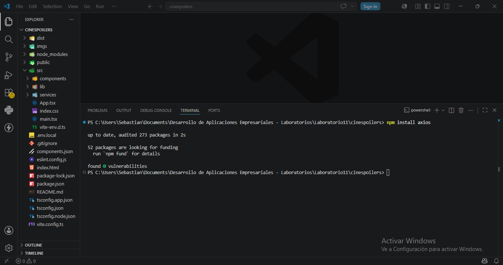

---

### 7. Fetching de datos

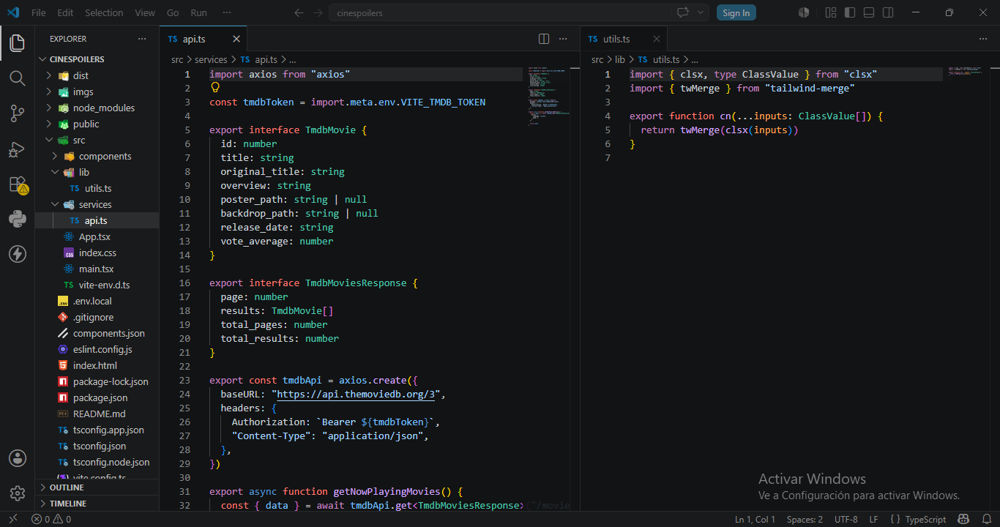

---

### 8. Mostrar por consola

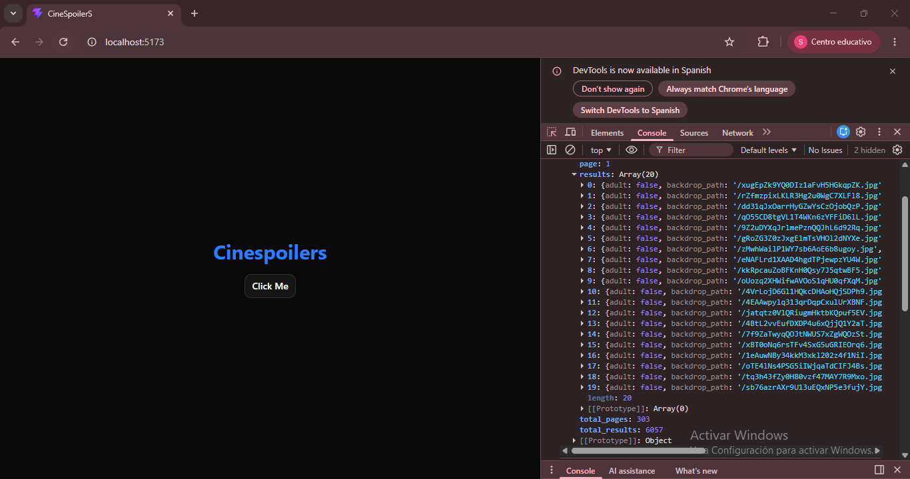

---

### 9. Renderizado de información

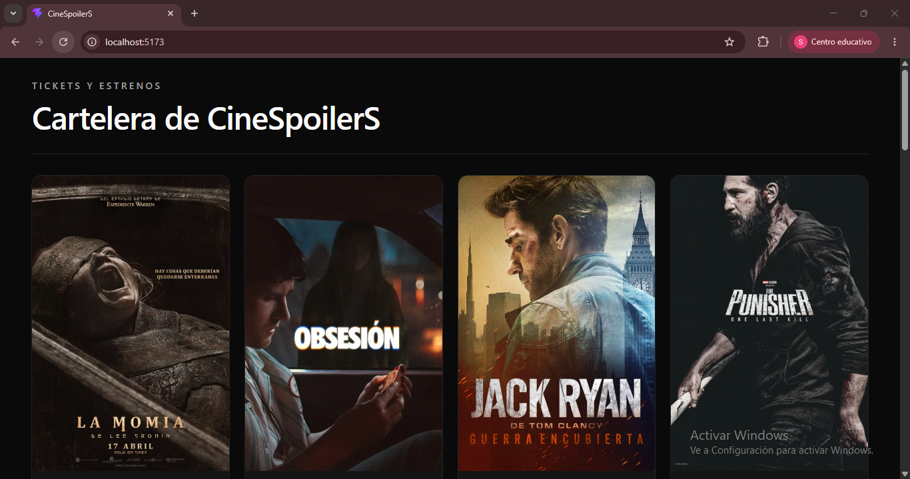

---

## Integrante 2: Ayala Gean Pierre

### 1. Crear proyecto

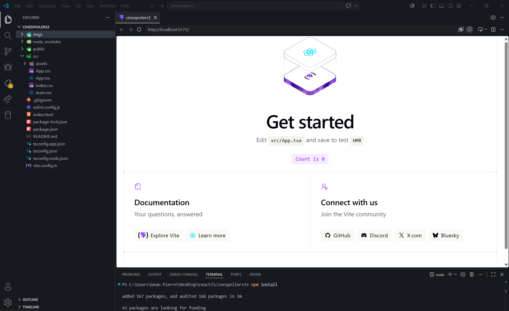

---

### 2. Limpiar proyecto

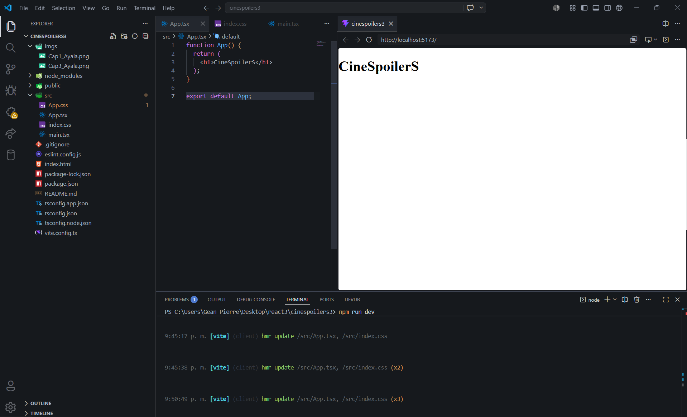

---

### 3. Instalar tailwind

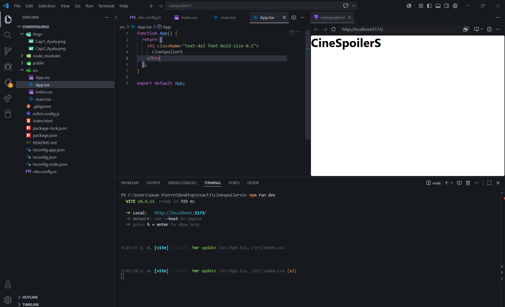

---

### 4. Configurar alias

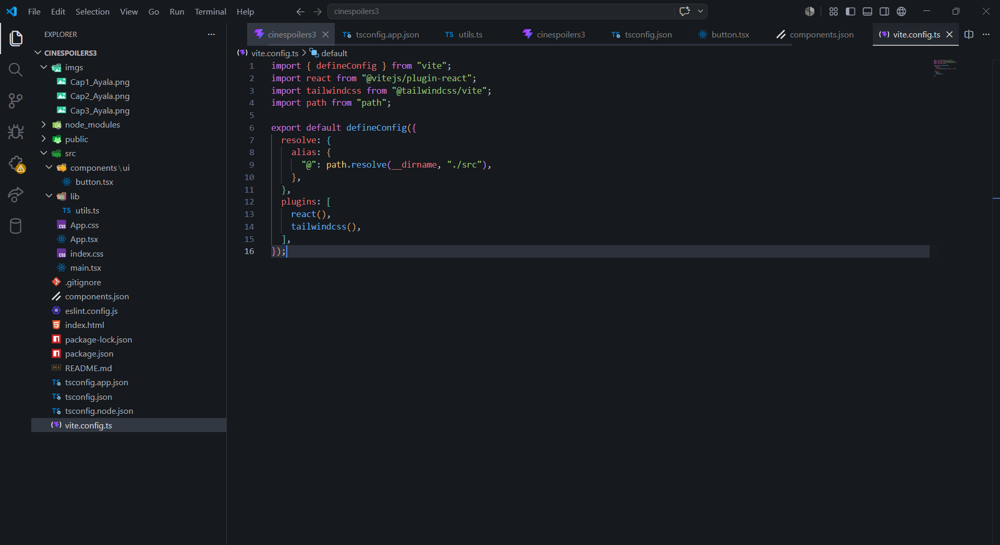

---

### 5. Instalar y configurar shadcn

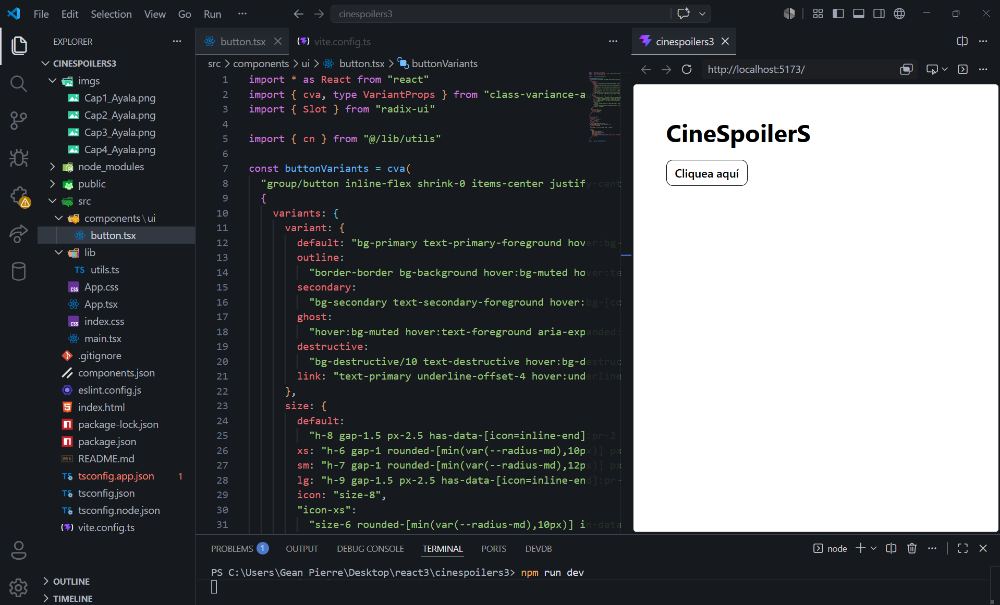

---

### 6. Instalar y configurar axios

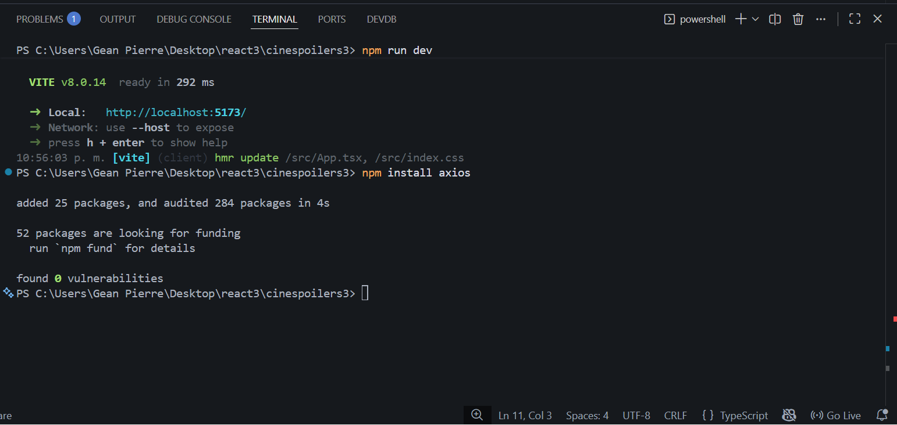

---

### 7. Fetching de datos

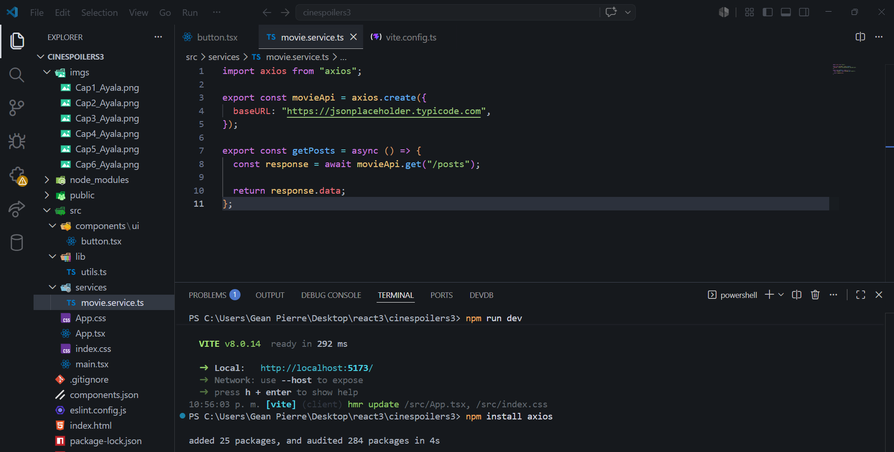

---

### 8. Mostrar por consola

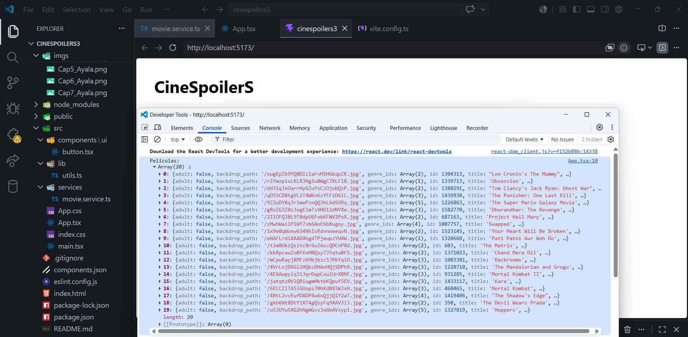

---

### 9. Renderizado de información

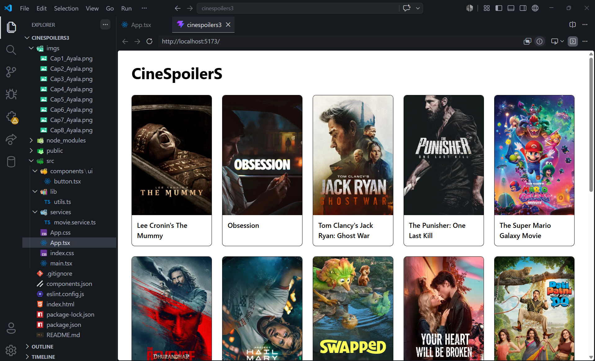

---